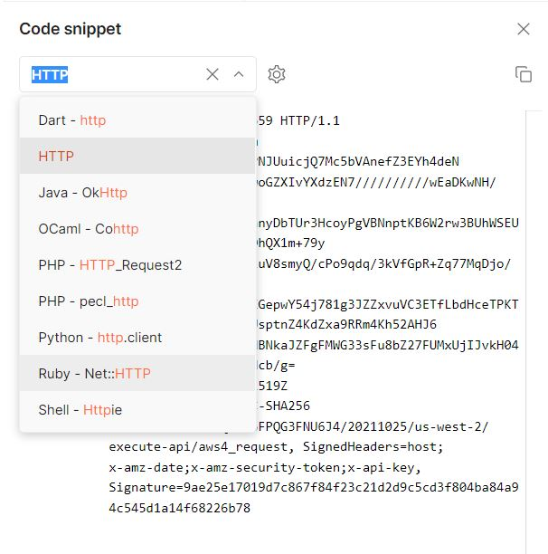
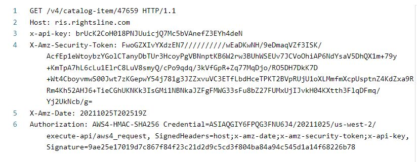

# Signing requests

Once you have [obtained temporary credentials](requesting-temporary-credentials.md),  you will use them to compute the Authorization signature for all additional requests to the API.&#x20;

#### Sample temporary credentials

```javascript
{
    "accessKey": "***********",
    "secretKey": "***************************",
    "sessionToken": "FQoDYXd//////====ONCXz6OZC6FIxoWO1CGxVkwnY6WT07ZdLgGkr5ZkRCnGpa5uiF5KKbgMMWyQjKIazeyarBvXleDQmJznO4tBKq3U709cY20lVkdzHwAJQ5HXWHVop6w6cRy8uyOFPZ9fPD79PJ0L9KUkSo9uIG8DUK7PRvs4eAtIQQFdW+j2eHx6sUlF====34098qojfaof",
    "expiration": "2018-01-01T00:00:01+00:00"
}
```

Rightsline utilizes [Amazon’s API Gateway](https://aws.amazon.com/api-gateway/) and authenticates all calls by leveraging both [STS](https://docs.aws.amazon.com/STS/latest/APIReference/welcome.html) and [AWS Signature V4](https://docs.aws.amazon.com/general/latest/gr/signature-version-4.html).  Instructions for computing the AWS V4 signature can be found [here](https://docs.aws.amazon.com/general/latest/gr/sigv4_signing.html).

### Postman

&#x20;Although you can construct this request by following the instruction contained above from [Amazon’s documentation](https://docs.aws.amazon.com/general/latest/gr/sigv4_signing.html), Rightsline recommends you utilize the instructions at [https://docs.aws.amazon.com/apigateway/latest/developerguide/how-to-use-postman-to-call-api.html](https://docs.aws.amazon.com/apigateway/latest/developerguide/how-to-use-postman-to-call-api.html), which will speed up the process quite a bit.&#x20;

Postman generates the HTTP Request in the required canonical format, including the code for signing a request in various languages:



&#x20;For your implementation, you will need to generate your Signing Key programmatically (Postman is doing it for you in the background). Instruction for calculating the AWS4-HMAC-SHA256 signature can be found here: [https://docs.aws.amazon.com/general/latest/gr/sigv4-calculate-signature.html](https://docs.aws.amazon.com/general/latest/gr/sigv4-calculate-signature.html) There are also great examples of how to generate the signature in various programming languages located here: [https://docs.aws.amazon.com/general/latest/gr/signature-v4-examples.html](https://docs.aws.amazon.com/general/latest/gr/signature-v4-examples.html)

### HTTP request example



1. HTTP Request Method (GET, POST, PUT, etc.) + Canonical URI + HTTP Protocol (HTTP/1.1)
2. Div API Key; unique to each Rightsline environment
3. Requested host URL, which will change depending on the API environment ris\[-staging, -int, -pm].rightsline.com
4. Date/Time of the request in Amazon’s required format YYYYMMDD’T’HHMMSS’Z’ ([https://docs.aws.amazon.com/general/latest/gr/sigv4-date-handling.html](https://docs.aws.amazon.com/general/latest/gr/sigv4-date-handling.html))
5. Authorization Header with calculated Signing Key. ([https://docs.aws.amazon.com/general/latest/gr/sigv4-create-string-to-sign.html](https://docs.aws.amazon.com/general/latest/gr/sigv4-create-string-to-sign.html))
