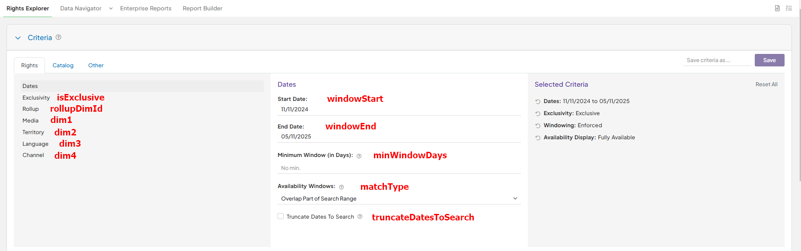
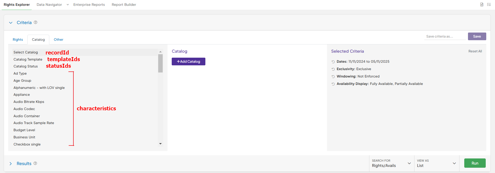
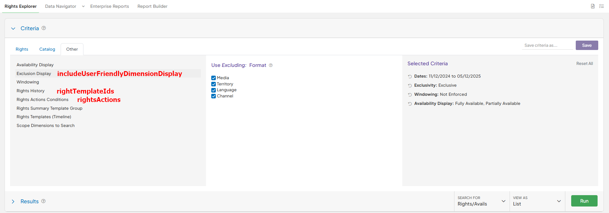

# Availability request vs Rights Explorer

The Availability API request is meant to provide catalog availability results that mimic the Rights Explorer in the Rightsline application. Listed below are the fields of the API Availability request and the corresponding fields in Rights Explorer.



<figure><figcaption>
Rights Explorer - Rights
</figcaption></figure>

| API field             | API type | Description                                                                                                           | Rights Explorer field             |
| --------------------- | -------- | --------------------------------------------------------------------------------------------------------------------- | --------------------------------- |
| windowStart           | string   | yyyy-mm-dd format                                                                                                     | Dates -> Start Date               |
| windowEnd             | string   | yyyy-mm-dd format                                                                                                     | Dates -> End Date                 |
| minWindowDays         | integer  | (Optional) - The minimum availability window in days.                                                                 | Dates -> Minimum Window (in Days) |
| matchType             | string   | CoverEntire, OverlapPart, StartWithin, EndWithin                                                                      | Dates -> Availability Windows     |
| truncateDatesToSearch | boolean  | True to truncate start and end dates in result to windowStart and windowEnd date parameters, False for entire window. | Dates -> Truncate Dates To Search |
| isExclusive           | boolean  | True for Exclusive, False for Non-Exclusive, null for no value                                                        | Exclusivity                       |
| rollupDimId           | integer  | (Optional) - The rights dimension to rollup.                                                                          | Rollup                            |
| dim1                  | array    | Array of type `INTEGER` of desired dim1 values                                                                        | Media                             |
| dim2                  | array    | Array of type `INTEGER` of desired dim2 values                                                                        | Territory                         |
| dim3                  | array    | Array of type `INTEGER` of desired dim3 values                                                                        | Language                          |
| dim4                  | array    | Array of type `INTEGER` of desired dim4 values                                                                        | Channel                           |



<figure><figcaption>
Rights Explorer - Catalog
</figcaption></figure>

<table><thead><tr><th width="157">API field</th><th width="190">API type</th><th>Description</th><th>Rights Explorer field</th></tr></thead><tbody><tr><td>recordId</td><td>array</td><td>Array of type <code>INTEGER</code> of desired catalog items</td><td>Select Catalog</td></tr><tr><td>templateIds</td><td>array</td><td>(Optional) - If <code>recordId</code> parameter is not included in request, you can specify specific template IDs of the catalog items instead. Array of type <code>INTEGER</code>.</td><td>Catalog Template</td></tr><tr><td>statusIds</td><td>array</td><td>(Optional) - If <code>recordId</code> parameter is not included in request, you can specify specific status IDs of the catalog items instead. Array of type <code>INTEGER</code>.</td><td>Catalog Status</td></tr><tr><td>characteristics</td><td>Map&#x3C;string,string[]></td><td>(Optional) - A key-value object of catalog characteristics that must match in the result records.</td><td>[Characteristics listed out individually]</td></tr></tbody></table>




<figure><figcaption>
Rights Explorer - Display
</figcaption></figure>

<figure><figcaption>
Rights Explorer - Other
</figcaption></figure>

<figure><figcaption>
Rights Explorer - Scope
</figcaption></figure>

<table><thead><tr><th width="198">API field</th><th>API type</th><th>Description</th><th>Rights Explorer field</th></tr></thead><tbody><tr><td>isExact</td><td>boolean</td><td>True for if the window dates should match exactly, False for flexible</td><td>Availability Display -> Fully Available / Partially Available</td></tr><tr><td>showUnavailable</td><td>boolean</td><td>Show unavailable avails</td><td>Availability Display -> Unavailable</td></tr><tr><td>includeUserFriendlyDimensionDisplay</td><td>boolean</td><td>List out all 4 dimension fields using Excluding format if applicable.</td><td>Exclusion Display</td></tr><tr><td>rightTemplateIds</td><td>array</td><td>(Optional) - Scope the results to specific rights templates. Array of type <code>INTEGER</code>.</td><td>Rights History</td></tr><tr><td>rightsActions</td><td>array</td><td>(Optional) - Apply the specific rights actions to the result.</td><td>Rights Actions Conditions</td></tr><tr><td>scopeExclusivity</td><td>boolean</td><td>(Optional) - Scope the results to Exclusivity.</td><td>Scope Dimensions to Search -> Exclusivity</td></tr><tr><td>scopeDimensions</td><td>array</td><td>(Optional) - Scope the results to specific rights dimensions. Array of type <code>INTEGER</code>.</td><td>Scope Dimensions to Search -> Media, Territory, Channel</td></tr></tbody></table>




| API field | API type | Description                        |
| --------- | -------- | ---------------------------------- |
| start     | string   | Record count start (0-based index) |
| rows      | integer  | Page result count (25 recommended) |



