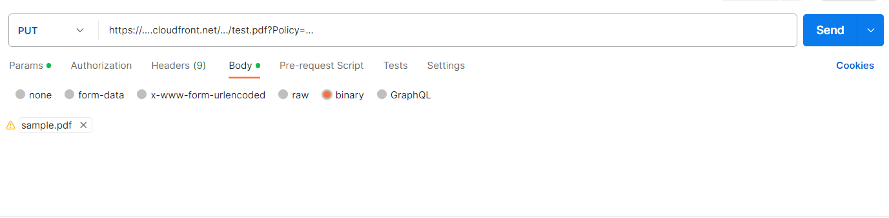

# External Document

`"allowMultiple"` can be set to true to allow more than one file to be uploaded to a single field.

Allows all file types to be uploaded.

| Value Precision | is AllowMultiple respected? | Has validation? |
| --------------- | --------------------------- | --------------- |
| -               | Yes                         | Yes             |

### External Document Data Type Definition

```json
{
     "fields" : [
     	{
	    "fieldName": "External Doc",
            "label": "external_doc",
            "required": false,
            "maxLength": 10000,
            "editable": true,
            "dataType": "ExternalDocument",
            "allowMultiple": false,
            "listOfValues": []
	},
        ...
    ]
}  
```

### Creating an entity with an external document

To create an entity with an external document characteristic, follow the following steps:

1. Request temporary credentials.
2. Build a POST request to one of the create entity endpoints, where the body has the following structure. Take note of the "external\_doc" characteristic, where we are passing the file name of the document as the value.

```json
{
    "title": "My New Deal",
    "template": {
        "templateId": 2
    },
    "characteristics": {
        "external_doc": "my_document.pdf"
    }
}
```

3. If your request is successful, you will receive the new entity ID in the response.
4. You will then retrieve your new entity using a GET request with the entity ID.
5. For the "external\_doc" characteristic, a URL will be returned in the response.

```
...
"characteristics": {
        "external_doc": "https://....cloudfront.net/..."
    },
...
```

6. You can then use this URL to upload the document binary directly to our AWS S3 storage, by doing a PUT request with the binary data of your document. In Postman, this would look like:

<figure><figcaption></figcaption></figure>
