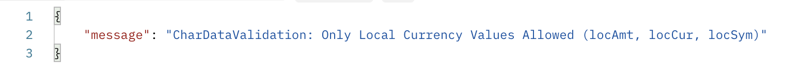

# Money

The Currency Value Set and Value Source must be selected for the Money Characteristic to work.

This field also presents a currency conversion from the selected currency to the company's default currency.\
\
The expected format of the value entered is a standard number with decimal. The full decimal entered is saved but not displayed.

| Value Precision | is AllowMultiple respected? | Has validation? |
| --------------- | --------------------------- | --------------- |
| .00             | No                          | Yes             |

### Example Money Field Value

```json
{
    "locAmt": 1.50,
    "locSym": "EUR",
    "locCur": 2,
    "divAmt": 1.75,
    "divSym": "USD",
    "divCur": 1
}
```


When setting or updating a money field via the API, you should only pass the `locAmt`, and either`locSym` or `locCur` fields. If any of the additional fields are present in the request you will be presented with an error.


<figure><figcaption></figcaption></figure>

### Example Creating Deal with Money Field ("allocated") with locSym


```json
{
    "title": "Test Deal",
    "template": {
        "templateId":1
    },
    "characteristics": {
        "allocated": {
            "locAmt": 10.00,
            "locSym": "EUR"
        } 
    }
}
```


### Example Creating Deal with Money Field ("allocated") with locCur


```json
{
    "title": "Test Deal",
    "template": {
        "templateId":1
    },
    "characteristics": {
        "allocated": {
            "locAmt": 10.00,
            "locCur": 4
        } 
    }
}
```



If you are using our new Three Level Currency Conversion Feature, API requirements can be found [here](https://rightsline.zendesk.com/hc/en-us/articles/15278043998619-Populating-Money-Fields-via-the-API).


### Money Data Type Definition

```json
{
     "fields" : [
     	{
	   "fieldName": "Money single",
	   "label": "money_single",
	   "required": false,
	   "maxLength": 10000,
	   "editable": true,
	   "dataType": "Money",
	   "allowMultiple": false,
	   "listOfValues": [
		{
			"id": 1,
			"label": "USD",
			"xref": null,
			"childValues": []
		},
		{
			"id": 2,
			"label": "GBP",
			"xref": null,
			"childValues": []
		},
		{
			"id": 3,
			"label": "JPY",
			"xref": null,
			"childValues": []
		}
		...
	    ]
	},
        ...
    ]
}  
```
