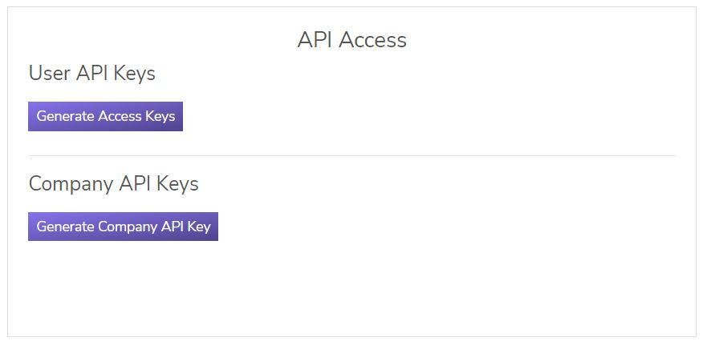

# Getting started

## Obtaining API Credentials

The three elements you will now need to make a request in API Version 4 are: Company API Key, Rightsline Access Key, and Rightsline Secret Access Key. The Company API Key is shared among your organization and is unique per environment (Staging, Integration, Prod Mirror, and Production). Your Access Key and Secret Access Key is unique for your API User account. It will inherit the security policy that is attached to your account.

1. **Login to your user account** from [https://app.rightsline.com](https://app.rightsline.com) (or if in the EU, use [https://app.rightsline.eu](https://app.rightsline.eu)).
2. Open your **Profile** from the drop-down menu, and in the _API Access_ module, click **Generate Access Keys** and **Generate Company API Key**.


You will use these keys to request temporary access keys to authenticate to the API. These keys are private. Please store them securely.


Once you have your Company API Key, and your User Account's Access and Secret Key, you are ready to make your first API request.
